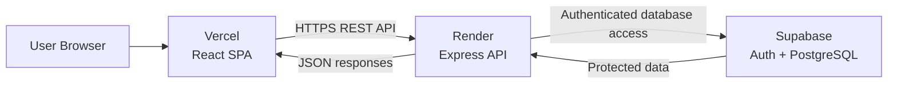

# StashBox

A full-stack bookmark management platform for saving, organizing, searching, and managing web bookmarks through hierarchical collections.

StashBox combines a React SPA, Express REST API, Supabase Authentication, and PostgreSQL to provide a secure multi-user bookmark management experience.

## Overview

StashBox is built around a simple idea: saving useful links should not mean losing them inside browser tabs, folders, or scattered notes.

Users can save bookmarks, automatically enrich them with webpage metadata, organize them into nested collections, and quickly search or manage everything from a responsive productivity-focused interface.

The application is designed as a real full-stack system rather than a frontend-only CRUD project, with separated client and server applications, authenticated API access, database-level authorization, and independent production deployment.

## Features

### Bookmark Management

* Save bookmarks by URL
* Automatic webpage metadata extraction
* Editable title, description, and collection
* Favorites and archive
* Bookmark deletion with confirmation
* Metadata refresh
* Search across title, URL, description, and domain
* Sorting by date and title
* Safe external-link handling
* Clipboard URL detection

### Hierarchical Collections

* Create, edit, and delete collections
* Nested collections with arbitrary depth
* Move bookmarks between collections
* Preserve bookmarks when a collection is deleted
* Unicode emoji collection icons
* Searchable emoji picker
* Expandable collection tree
* Collection-specific action menu

### Productivity & UI

* Grid, Masonry, and List views
* Bookmark detail/reading pane
* Light / Dark / System themes
* Responsive desktop and mobile layouts
* Keyboard shortcuts
* Contextual empty states
* Loading skeletons
* Optimistic UI updates

These capabilities are implemented in the current application.

## Tech Stack

| Layer            | Technology                       |
| ---------------- | -------------------------------- |
| Frontend         | React 19, Vite 8, Tailwind CSS 4 |
| Routing          | React Router                     |
| Icons            | Lucide React                     |
| Emoji UI         | emoji-picker-react               |
| Backend          | Node.js, Express 5               |
| Database         | PostgreSQL                       |
| Backend Services | Supabase                         |
| Authentication   | Supabase Auth                    |
| Authorization    | PostgreSQL Row Level Security    |
| Deployment       | Vercel + Render + Supabase       |
| Tooling          | ESLint, Nodemon, Git             |

## Architecture



### Responsibilities

**Frontend**

* React application
* Client-side routing
* Responsive UI
* Search, filtering, and sorting
* API communication
* Authentication state management

**Backend**

* REST API
* Authentication and authorization
* Collection and bookmark operations
* Metadata extraction
* Request protection and rate limiting
* Production CORS and security configuration

**Supabase**

* Authentication
* PostgreSQL persistence
* Row Level Security
* Database relationships and triggers

The frontend and backend are independently deployable applications communicating through REST APIs.

## Data Model

The application centers around three primary entities:

```text
Auth User
   │
   ├── Profile
   │
   ├── Collections
   │      └── Nested Collections
   │
   └── Bookmarks
          └── Collection
```

### Collections

Collections use a self-referencing relationship to support nested organization without requiring a separate hierarchy table.

### Bookmarks

Bookmarks can optionally belong to a collection while retaining their own metadata, favorite state, archive state, and timestamps.

A deliberate database relationship ensures that deleting a collection does not automatically delete the bookmarks stored inside it; those bookmarks can remain available as unassigned items.

## Authentication & Authorization

Authentication is handled through Supabase Auth using email/password authentication and JWT-based sessions.

The application combines multiple layers of authorization:

```text
Authentication
      ↓
Backend authorization
      ↓
Database Row Level Security
```

This layered approach ensures that user ownership is enforced both by the application and by the database itself rather than relying on a single protection boundary.

## Security

Security was treated as part of the application architecture rather than as an afterthought.

Implemented protections include:

* JWT-based authentication
* Database Row Level Security
* Application-level authorization
* Production CORS restrictions
* Request rate limiting
* Security headers
* Request size limits
* URL validation
* Protected webpage metadata fetching
* HTML sanitization of scraped metadata
* Environment-based configuration for sensitive values
* Safe handling of external bookmark links

The metadata extraction system also includes protections designed to prevent unsafe server-side requests and resource-exhaustion scenarios.

## Automated Metadata Extraction

When a bookmark is added, StashBox attempts to enrich it automatically by inspecting metadata exposed by the target webpage.

The system can extract information such as:

* Page title
* Description
* Domain
* Favicon
* Preview image

This allows a user to save a URL without manually entering every piece of information. The metadata pipeline also performs validation and sanitization before the data is used by the application.

## API

The backend is organized around three resource groups:

```text
Authentication
Collections
Bookmarks
```

The API supports account/session operations, hierarchical collection management, bookmark CRUD, favorites, archive state, and metadata refresh. The current implementation exposes 16 REST endpoints across these areas.

## UI / UX

StashBox is designed as a productivity-oriented application rather than a basic dashboard.

### Interface

* Responsive sidebar
* Sticky application toolbar
* Responsive bookmark layouts
* Bookmark detail pane
* Context menus
* Emoji-based collection icons
* Responsive mobile navigation
* Empty states and loading states

### Themes

* Light
* Dark
* System

### Productivity

* `⌘K` / `Ctrl K` → search
* `N` → new bookmark
* `Escape` → close detail view
* Clipboard URL detection
* Optimistic favorite/archive interactions

The application includes responsive behavior across desktop and mobile layouts.

## Project Structure

```text
StashBox/
├── client/
│   ├── src/
│   │   ├── api/
│   │   ├── components/
│   │   ├── contexts/
│   │   ├── pages/
│   │   └── ...
│   ├── package.json
│   └── vercel.json
│
├── server/
│   ├── config/
│   ├── controllers/
│   ├── middleware/
│   ├── routes/
│   ├── server.js
│   └── package.json
│
└── README.md
```

The client and server maintain independent dependencies and deployment environments.

## Local Development

### Prerequisites

* Node.js
* npm
* Supabase project

### Frontend

```bash
cd client
npm install
npm run dev
```

### Backend

```bash
cd server
npm install
npm run dev
```

The frontend runs on the Vite development server while the backend runs as a separate Express service.

## Environment Variables

### Server

```env
SUPABASE_PROJECT_URL=
SUPABASE_KEY=
CLIENT_URL=
PORT=
```

### Client

```env
VITE_API_URL=
```

## Production Deployment

StashBox is deployed using three separate services:

```text
Vercel
└── React / Vite frontend

Render
└── Express backend

Supabase
├── PostgreSQL
└── Authentication
```

The production frontend connects to the Express API over HTTPS, while the backend communicates with Supabase for authentication and persistent application data.

## Quality & Validation

Current validation includes:

* Successful production builds
* ESLint configuration
* Successful backend startup
* Production health check

Automated unit and end-to-end testing are planned future improvements and are not currently configured in the repository.

## Engineering Decisions

### Decoupled Client-Server Architecture

Keeping the frontend and backend as independently deployable applications allows each layer to use infrastructure suited to its role.

### Hierarchical Collections

A self-referencing collection relationship provides nested organization while keeping the database model straightforward.

### Safe Collection Deletion

Bookmarks remain preserved when their parent collection is removed rather than being deleted along with it.

### Secure Metadata Extraction

Bookmark metadata is extracted automatically while treating external URLs as untrusted input.

### Unicode Collection Icons

Collection icons are stored as Unicode emoji values, allowing users to personalize collections without maintaining a large custom icon catalog.

### Optimistic Interactions

Frequent actions such as favorite and archive provide immediate UI feedback before server synchronization completes.

## Future Improvements

Potential next steps include:

* Automated unit and end-to-end testing
* TypeScript migration
* Server-side search
* Pagination for larger bookmark libraries
* CI/CD automation
* Bookmark import/export
* Additional observability and scaling improvements

These are future improvements and are not currently presented as existing functionality.

## Author

Parth Jadhav

Computer Science student

StashBox was developed as an Indie project to explore practical full-stack web application development, secure multi-user data handling, and production deployment.
